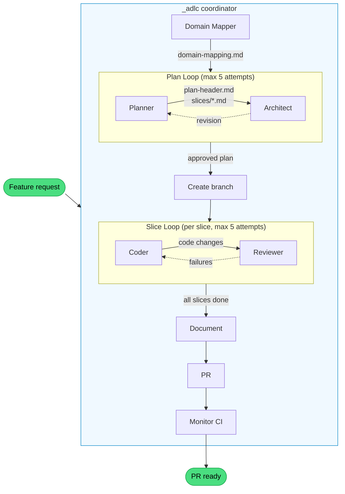

# plantz-claude-v2

A plants watering app used as a proof-of-concept for a **Claude Code agent harness** — a structured setup that builds around the agent rather than forcing it into a rigid workflow.

:point_right: App: https://plantz-claude.netlify.app/

:point_right: Storybook: https://plantz-claude-storybook.netlify.app/

## What's in this repo

### The application

A pnpm monorepo with Turborepo orchestration and [Squide](https://github.com/gsoft-inc/wl-squide) modules.

```
apps/
  host/                        # Thin shell — bootstraps Squide, no domain logic
  management/
    plants/                    # Management domain module
    user/                      # User profile module
    storybook/                 # Management domain Storybook + Chromatic
  today/
    landing-page/              # Today domain module
    vacation-planner/          # Vacation planner module
    storybook/                 # Today domain Storybook + Chromatic
  storybook/                   # Unified Storybook — all stories
packages/
  components/                  # Shared UI — shadcn/ui (Base UI) + Tailwind v4
  core-module/                 # Cross-module infrastructure — session, auth, app shell
  core-plants/                 # Shared plants data layer (MSW handlers, TanStack DB, seed data)
  storybook/                   # Packages-layer Storybook
```

Each domain is fully isolated — modules never import from each other. Each has its own Storybook and Chromatic token for independent visual regression testing.

### Tech stack

Node 24+, pnpm 10, TypeScript 7 (tsgo), Rsbuild, Vite (Storybooks), Tailwind CSS 4, TanStack DB, Storybook 10, Chromatic, Vitest, Playwright, oxlint, oxfmt, syncpack, knip, gitleaks.

---

## Agent harness

The harness enhances the agent's natural capabilities instead of micromanaging each step. Skills define _what_ to do — lightweight orchestration that tells the agent where to go next. Hooks enforce _how well_ — automated verification, autofix, and context delivery that runs whether the agent remembers or not.

### Token compression

The full `preflight` design is documented in [`.claude/hooks/src/preflight/README.md`](.claude/hooks/src/preflight/README.md).

The `preflight` PreToolUse hook rewrites supported Bash commands through [RTK](https://github.com/rtk-ai/rtk) for 60–90% token savings on git, gh, lint, and test output. The hook delegates to `rtk rewrite` — if RTK doesn't support the command, it passes through unchanged. When RTK is not installed, the rewrite is a no-op.

### Design principles

This design is based on three principles from the [Agent Harness](https://medium.com/@bijit211987/agent-harness-b1f6d5a7a1d1) article:

| #   | Principle                                  | Status                         | Implementation                                     |
| --- | ------------------------------------------ | ------------------------------ | -------------------------------------------------- |
| 1   | Verification is not optional               | :white_check_mark: Implemented | SubagentStop hooks, pre-commit guards, permissions |
| 2   | Context should be delivered, not requested | :construction: Planned         | —                                                  |
| 3   | Supervision must be real-time              | :white_check_mark: Implemented | Supervisor hooks, recovery contracts               |

### ADLC workflow

One skill and eight custom agents form an Agent Development Life Cycle (ADLC). The `_adlc` skill runs inline in the main conversation as orchestrator — it spawns agents and manages all loops directly. Agents run as isolated subprocesses — their `name` flows to SubagentStop hooks for verification. Hooks fire at each agent's completion to verify its work before the workflow advances.



**Skill** (orchestrator — runs inline, spawns agents):

| Skill   | What it does                                                                                   |
| ------- | ---------------------------------------------------------------------------------------------- |
| `_adlc` | Entry point. Cleans `.adlc/`, runs plan loop, creates branch, runs slice loops, then doc/PR/CI |

**Agents** (workers — run as isolated subprocesses, verified by SubagentStop hooks):

| Agent                 | What it does                                                                            |
| --------------------- | --------------------------------------------------------------------------------------- |
| `_adlc-domain-mapper` | Analyzes feature terms against existing modules, writes placement decisions             |
| `_adlc-planner`       | Drafts a multi-slice plan with acceptance criteria per slice                            |
| `_adlc-architect`     | Structural review gate — flags wrong boundaries, missing denormalization, weak criteria |
| `_adlc-coder`         | Implements a single slice — code, MSW handlers, Storybook stories                       |
| `_adlc-reviewer`      | Verifies acceptance criteria via browser screenshots and interactions                   |
| `_adlc-document`      | Updates domain docs and architecture references to reflect what was built               |
| `_adlc-pr`            | Pushes branch, opens PR with summary and technical changes                              |
| `_adlc-monitor`       | Polls CI workflows, auto-fixes failures (lint, Chromatic, Lighthouse)                   |

All inter-step coordination goes through files in `.adlc/` — plan-header, slices, verification-results, implementation-notes, domain-mapping. This makes handoffs explicit and debuggable.

**Files:** [`.claude/skills/_adlc/`](.claude/skills/_adlc/), [`.claude/agents/`](.claude/agents/)

### Principle 1: Verification is not optional

Every subagent is verified by hooks before the workflow advances. The agent cannot skip verification — it's infrastructure, not instructions.

Hooks fall into four categories: **verificators** that block completion until checks pass, **context refreshers** that surface easy-to-forget concerns at stop time, **autofixers** that correct issues before validation, and **guards** that enforce constraints on every tool call.

#### Verificators

Block a subagent's completion until its deliverables meet structural and quality checks. If any check fails, the problems are fed back to the agent for correction.

| Agent                 | Check                | What it validates                                                      |
| --------------------- | -------------------- | ---------------------------------------------------------------------- |
| `_adlc-coder`         | lint                 | Full monorepo lint — oxlint, oxfmt, typecheck, syncpack, knip          |
| `_adlc-coder`         | tests                | Full monorepo tests — Vitest + Storybook a11y via Playwright           |
| `_adlc-coder`         | no-file-disable      | Rejects file-level `/* oxlint-disable */` comments (line-level only)   |
| `_adlc-coder`         | no-secrets           | gitleaks scan on changed files                                         |
| `_adlc-coder`         | import-guard         | 4-layer architectural boundary enforcement (host → modules → packages) |
| `_adlc-coder`         | implementation-notes | `.adlc/implementation-notes.md` must be created or updated             |
| `_adlc-coder`         | story-coverage       | Every changed component in a module needs a matching `.stories.tsx`    |
| `_adlc-planner`       | plan-header          | `.adlc/plan-header.md` must exist and be non-empty                     |
| `_adlc-planner`       | slice-files          | At least one `.md` file in `.adlc/slices/`                             |
| `_adlc-planner`       | slice-criteria       | Every slice must have `- [ ]` acceptance criteria                      |
| `_adlc-architect`     | no-plan-mutations    | Must not modify plan files (read-only review)                          |
| `_adlc-architect`     | revision-slice-refs  | Revision must reference specific slices with evidence                  |
| `_adlc-domain-mapper` | mapping-file         | `.adlc/domain-mapping.md` must exist                                   |
| `_adlc-domain-mapper` | no-plan-mutations    | Must not modify plan files                                             |
| `_adlc-reviewer`      | verification-results | `.adlc/verification-results.md` must exist                             |
| `_adlc-reviewer`      | criteria-coverage    | Results must cover every acceptance criterion from the slice           |

#### Context refreshers

By the time a subagent reaches completion, its original skill instructions are buried under thousands of tokens of code and tool output. Context refreshers block once per slice with a concise checklist — forcing recency-bias attention on concerns that are easy to forget.

| Agent         | Refresh         | What it reminds                                    |
| ------------- | --------------- | -------------------------------------------------- |
| `_adlc-coder` | context-refresh | MSW handlers, story variants, implementation notes |

Uses `.adlc/markers.json` keyed by slice name so the checklist fires once per slice — not on every stop attempt.

#### Autofixers

Run corrections before validation to reduce noise. Formatting violations never appear as failures.

| Agent            | Autofix       | What it does                        |
| ---------------- | ------------- | ----------------------------------- |
| `_adlc-coder`    | oxfmt-autofix | `oxfmt --write .` before lint phase |
| `_adlc-document` | oxfmt-autofix | `oxfmt --write .` after doc updates |

#### Run metrics

On every agent completion, the SubagentStop hook parses the agent's transcript JSONL and appends a run entry to `.adlc/run-metrics.json`. Each entry includes a token breakdown (input, output, cache read, cache creation), per-tool use counts (e.g. `Read: 12, Edit: 5`), wall time, and timestamps. Totals are recomputed on each write. Metrics are recorded for all agents — verified (coder, reviewer, etc.) and unverified (`_adlc`, `_adlc-pr`) — including resumed agents after reviewer failures, preserving chronological order.

#### Pre-commit and tool guards

Constraints that apply to every tool call, regardless of which skill is running.

| Hook                | Trigger                    | What it does                                                                                                                                                          |
| ------------------- | -------------------------- | --------------------------------------------------------------------------------------------------------------------------------------------------------------------- |
| `preflight`         | Bash + Read                | Rewrites `agent-browser` and RTK-supported Bash commands, then blocks disallowed package-manager calls, bare `pnpm typecheck`, `cmd`, and `node_modules` source reads |
| `supervisor`        | Bash + Read + Write + Edit | Detects browser thrash, repeated edits, repeated command loops, and evidence-gated `pnpm install` misuse in real time; blocks into recovery or narrow retry paths     |
| `gitignore-guard`   | `git commit`               | Blocks commits that add `!.adlc/` negation patterns to `.gitignore` (all ADLC artifacts are ephemeral)                                                                |
| `pre-tool-use-bash` | `git commit`               | Intercepts commits — runs oxfmt autofix, then build + lint + tests in parallel before allowing                                                                        |

#### Permissions

Deny rules in `.claude/settings.json` block `Edit` and `Write` on `.env` and `.env.*` files — the agent cannot accidentally modify environment secrets.

**Files:** [`.claude/hooks/src/`](.claude/hooks/src/), [`.claude/hooks/src/adlc-verification/README.md`](.claude/hooks/src/adlc-verification/README.md), [`.claude/hooks/src/pre-commit/README.md`](.claude/hooks/src/pre-commit/README.md), [`.claude/hooks/src/preflight/README.md`](.claude/hooks/src/preflight/README.md), [`.claude/hooks/src/supervisor/README.md`](.claude/hooks/src/supervisor/README.md), [`.claude/hooks/tests/`](.claude/hooks/tests/), [`.claude/settings.json`](.claude/settings.json)

#### Hook architecture

All hook source lives in `.claude/hooks/src/`, organized by concern. Tests live in `.claude/hooks/tests/`, mirroring the same structure.

```
.claude/hooks/
  src/
    adlc-verification/
      subagent-stop.mjs          # Router — dispatches to agent-specific handlers
      run-metrics.mjs            # Parses transcript JSONL, appends to .adlc/run-metrics.md
      utils.mjs                  # .adlc artifact helpers + getChangedFiles; re-exports run from shared/
      architect/                 # 2 checks
      coder/                     # 7 checks + 1 autofix + 1 context refresh
      document/                  # 1 autofix
      domain-mapper/             # 2 checks
      planner/                   # 3 checks
      reviewer/                  # 2 checks
    pre-commit/                  # git commit interceptor + build/lint/test/gitignore-guard pipeline
    preflight/                   # Bash/Read guardrails + command rewrites
    shared/
      run.mjs                    # Async shell execution — used by pre-commit and adlc-verification
    supervisor/                  # Stateful real-time supervision + recovery contracts + install evidence
  tests/
    contract-sync.test.mjs       # Hook registration contract test
    pre-commit/                  # 7 test files
    preflight/                   # 7 test files
    supervisor/                  # 3 test files
    adlc-verification/
      *.test.mjs                 # 3 root tests (subagent-stop, run-metrics, utils)
      architect/                 # 3 test files
      coder/                     # 12 test files
      document/                  # 1 test file
      domain-mapper/             # 2 test files
      planner/                   # 5 test files
      reviewer/                  # 3 test files
    fixtures/                    # Valid/invalid markdown fixtures
```

### Principle 2: Context should be delivered, not requested

:construction: **Planned** — Hooks that inject relevant context into the agent's working memory at the right moment, so the agent doesn't need to search for information it will inevitably need. The goal is to reduce context-seeking tool calls and prevent decisions made without full context.

### Principle 3: Supervision must be real-time

:white_check_mark: **Implemented** — A supervisor hook now observes `Bash`, `Read`, `Write`, and `Edit` calls during execution, logs them to `.adlc/supervisor-events.jsonl`, and maintains live state in `.adlc/supervisor-state.json`. It also consumes `PostToolUse` and `PostToolUseFailure` events for Bash so command-result evidence can unlock narrow recovery paths such as a one-shot `pnpm install` bypass after real missing-dependency failures.

When the supervisor detects a high-signal failure mode, it blocks the next bad action and creates a recovery contract in `.adlc/supervisor-recovery.json`. While recovery is active, only recovery-progress actions are allowed through. The first MVP policies are:

- `browser-thrash` — browser budget, consecutive browser circuit breaker, and screenshot nudge
- `repeated-edit` — stops edit churn on the same file and requires a diagnosis in `.adlc/supervisor-recovery.md`
- `tool-call-thrash` — stops repeated identical Bash commands until the agent changes evidence path or strategy
- `install-gate` — blocks blind `pnpm install` until manifests changed, an override exists, or a post-tool dependency failure grants a one-shot bypass

This keeps supervision in-band and real-time: the harness interrupts waste as it happens and steers the agent back onto an observable recovery path before autonomy resumes.

The full supervisor design is documented in [`.claude/hooks/src/supervisor/README.md`](.claude/hooks/src/supervisor/README.md), including runtime flow, state files, event semantics, recovery contracts, evidence collection, and the `pnpm install` override model.

---

## Supporting skills

Non-ADLC skills that agents load at runtime for scaffolding and validation.

| Skill                        | What it does                                                                         |
| ---------------------------- | ------------------------------------------------------------------------------------ |
| `_scaffold-domain`           | Creates a new domain directory with its first module and domain Storybook            |
| `_scaffold-domain-module`    | Scaffolds a new Squide module — files, host registration, Storybook wiring           |
| `_scaffold-domain-storybook` | Scaffolds a domain-scoped Storybook with Chromatic CI integration                    |
| `_validate-modules`          | Validates module structure and wiring (files, exports, host registration, Storybook) |

Scaffolding skills use a **reference module pattern** — instead of hardcoding versions or configs, they read a canonical module (`apps/management/plants/`) at runtime and clone from it.

**Files:** [`.claude/skills/`](.claude/skills/)

---

## Getting started

### Prerequisites

- Node.js 24+
- pnpm 10+
- [Claude Code](https://docs.anthropic.com/en/docs/claude-code) CLI

### Install

```bash
pnpm install
```

#### RTK

Optional — install [RTK](https://github.com/rtk-ai/rtk) for token-compressed Bash output during Claude Code sessions (60–90% savings):

```bash
# macOS / Linux
curl -fsSL https://rtk.sh | bash

# Windows (winget)
winget install rtk-ai.rtk
```

When `rtk` is on `PATH`, `preflight` rewrites supported Bash commands automatically. Without it, the rewrite is a no-op.

### Seed data

Plant data lives in an MSW in-memory database. Data resets on every reload — no manual seeding needed.

### Run the app

```bash
pnpm dev-host                      # Full app — all modules (http://localhost:8080)
pnpm dev-management-plants         # Just the plants module
pnpm dev-management-user           # Just the user profile module
pnpm dev-today-landing-page        # Just the today landing page module
pnpm dev-today-vacation-planner    # Just the vacation planner module
```

To load specific modules manually:

```bash
cross-env MODULES=management/plants pnpm dev-host
```

### Run Storybooks

```bash
pnpm dev-storybook               # Unified Storybook — all stories (http://localhost:6006)
pnpm dev-packages-storybook      # Shared components
pnpm dev-management-storybook    # Management domain
pnpm dev-today-storybook         # Today domain
```

### Run checks

```bash
pnpm lint          # ESLint (per-package, via Turborepo)
pnpm test          # Storybook a11y tests (Vitest + Playwright, via Turborepo)
pnpm oxlint        # oxlint (custom config in oxlintrc.json)
pnpm oxfmt         # Formatter check (oxfmt with Tailwind class sorting)
pnpm typecheck     # TypeScript (tsgo)
pnpm syncpack      # Dependency version consistency
pnpm knip          # Dead code detection (unused files, deps, exports)
```
