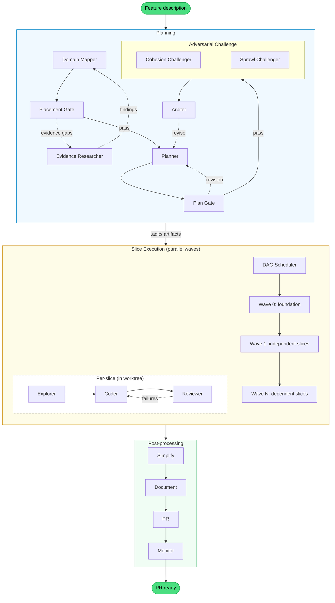

# ADLC Orchestrator (v3)

A headless CLI that plans, implements, and ships features using a multi-agent pipeline. Built on the [Claude Agent SDK](https://docs.anthropic.com/en/docs/claude-code/sdk), it replaces the in-process SKILL.md orchestrator with an external Node.js process that supports parallel slice execution via git worktrees.

## What is an agent harness?

An agent harness enhances the agent's natural capabilities instead of micromanaging each step. Rather than scripting every tool call, it provides:

- **Skills** that define _what_ to do — lightweight orchestration that tells the agent where to go next
- **Hooks** that enforce _how well_ — automated verification, autofix, and context delivery that runs whether the agent remembers or not

The design is based on three principles from the [Agent Harness](https://medium.com/@bijit211987/agent-harness-b1f6d5a7a1d1) article:

| # | Principle | Implementation |
|---|-----------|----------------|
| 1 | Verification is not optional | SubagentStop hooks, pre-commit guards, tool guards |
| 2 | Context should be delivered, not requested | Project context preamble, reference doc injection |
| 3 | Supervision must be real-time | Supervisor policies (wall-clock, test-thrash, browser-thrash, install-gate) |

Every subagent is verified by hooks before the workflow advances. The agent cannot skip verification — it's infrastructure, not instructions.

## What changed from v2

| Aspect | v2 (SKILL.md) | v3 (Agent SDK) |
|--------|----------------|----------------|
| Orchestration | `_adlc` skill runs inline in the main conversation | External Node.js process — `adlc` CLI |
| Parallelism | Sequential slices on one branch | Parallel slices via git worktrees |
| Supervisor state | Disk-based JSON in `.adlc/supervisor-state.json` | In-memory — no I/O between tool calls |
| Hook protocol | stdin/stdout JSON over subprocess boundary | Direct function calls in the same process |
| Entry point | `/adlc` slash command inside Claude Code | `adlc` CLI binary |

## Pipeline



## Agents

Fifteen agents form the pipeline. Each is defined as a markdown file with YAML frontmatter in `agents/`, loaded at runtime by `src/workflow/agents.ts`.

| Agent | What it does |
|-------|-------------|
| `domain-mapper` | Analyzes feature terms against existing modules, writes placement decisions |
| `evidence-researcher` | Resolves mapper evidence gaps by inspecting code artifacts |
| `placement-gate` | Holistic quality gate — reviews the entire mapping for architectural coherence |
| `sprawl-challenger` | Challenges create decisions with concrete extension proposals |
| `cohesion-challenger` | Checks extend decisions for god-module risk |
| `challenge-arbiter` | Synthesizes challenger debate into unified verdict |
| `planner` | Drafts a multi-slice plan with acceptance criteria per slice |
| `plan-gate` | Structural review gate — flags wrong boundaries, missing denormalization, weak criteria |
| `explorer` | Surveys reference packages for a slice, returns patterns summary for the coder |
| `coder` | Implements a single slice — code, MSW handlers, Storybook stories |
| `reviewer` | Verifies acceptance criteria via browser screenshots and interactions |
| `simplify` | Reviews changed code for reuse, quality, and efficiency, then fixes issues |
| `document` | Updates module docs and architecture references to reflect what was built |
| `pr` | Pushes branch, opens PR with summary and technical changes |
| `monitor` | Polls CI workflows, auto-fixes failures (lint, Chromatic, Lighthouse) |

All inter-agent coordination goes through files in `.adlc/` — plan-header, slices, verification-results, implementation-notes, domain-mapping. This makes handoffs explicit and debuggable.

## Runtime hooks

Every agent instance runs with three hook layers, wired as SDK `HookCallbackMatcher` callbacks in `src/hooks/create-hooks.ts`.

### Guards

PreToolUse hooks that inspect and optionally rewrite commands before execution.

| Guard | Trigger | What it does |
|-------|---------|-------------|
| `block-npm` | Bash | Blocks `npm`, `npx`, `pnpx`, `pnpm dlx` — only `pnpm` allowed |
| `block-windows-cmd` | Bash | Blocks `cmd` / `cmd.exe` invocations on Windows |
| `block-node-modules-read` | Bash, Read, Glob | Blocks reading `node_modules` source (type definitions `.d.ts` are allowed) |
| `agent-browser-rewrite` | Bash | Rewrites bare `agent-browser` to `pnpm exec agent-browser` |

### Supervisor policies

Stateful policies that observe tool calls in real time. State is in-memory — shared across all tool calls within a single agent run, no disk I/O.

| Policy | What it detects | Response |
|--------|----------------|----------|
| `wall-clock` | Agent running too long | Nudge at threshold, hard stop at limit. Per-agent thresholds. |
| `browser-thrash` | Browser stuck loops | Dual detection: density (cross-page spirals) + repetition (same-page probing). Tiered recovery gates. Total budget cap. |
| `test-thrash` | Test reruns without code edits | Edit-gap detection with tiered recovery. Requires code changes between test runs. |
| `install-gate` | Blind `pnpm install` | Blocks unless manifests changed, an override exists, or a PostToolUse dependency failure grants a one-shot bypass. |

### Verification handlers

SubagentStop hooks that run post-completion checks per agent type. If any check fails, the problems are fed back to the agent for correction.

| Agent | Check | What it validates |
|-------|-------|-------------------|
| `coder` | build | Full monorepo build |
| `coder` | lint | Full monorepo lint — oxlint, oxfmt, typecheck, syncpack, knip |
| `coder` | tests | Full monorepo tests — Vitest + Storybook a11y via Playwright |
| `coder` | no-file-disable | Rejects file-level `/* oxlint-disable */` comments (line-level only) |
| `coder` | no-secrets | gitleaks scan on changed files |
| `coder` | import-guard | 4-layer architectural boundary enforcement (host > modules > packages) |
| `coder` | implementation-notes | A file in `.adlc/implementation-notes/` must be created or updated |
| `coder` | story-coverage | Every changed component in a module needs a matching `.stories.tsx` |
| `planner` | plan-header | `.adlc/plan-header.md` must exist and be non-empty |
| `planner` | slice-files | At least one `.md` file in `.adlc/slices/` |
| `planner` | slice-criteria | Every slice must have `- [ ]` acceptance criteria |
| `planner` | slice-ref-packages | Every slice must have a Reference Packages section |
| `plan-gate` | no-plan-mutations | Must not modify plan files (read-only review) |
| `plan-gate` | revision-slice-refs | Revision must reference specific slices with evidence |
| `domain-mapper` | mapping-file | `.adlc/domain-mapping.md` must exist |
| `domain-mapper` | engagement-check | Every medium+ confidence challenge has a resolution entry |
| `evidence-researcher` | evidence-findings | `.adlc/current-evidence-findings.md` must exist |
| `placement-gate` | no-plan-mutations | Must not modify plan files |
| `placement-gate` | revision-issues | If revision exists, must contain `ISSUE` blocks |
| `reviewer` | verification-results | `.adlc/verification-results.md` must exist |
| `reviewer` | criteria-coverage | Results must cover every acceptance criterion from the slice |

#### Context refreshers

| Agent | Refresh | What it reminds |
|-------|---------|-----------------|
| `coder` | context-refresh | MSW handlers, story variants, implementation notes |

#### Autofixers

| Agent | Autofix | What it does |
|-------|---------|-------------|
| `coder` | oxfmt-autofix | `oxfmt --write .` before lint phase |
| `simplify` | oxfmt-autofix | `oxfmt --write .` before lint phase |
| `document` | oxfmt-autofix | `oxfmt --write .` after doc updates |

#### Run metrics

On every agent completion, the SubagentStop hook parses the agent's transcript JSONL and appends a run entry to `.adlc/run-metrics.json`. Each entry includes token breakdown (input, output, cache read, cache creation), per-tool use counts, wall time, and timestamps.

### Pre-commit gate

| Hook | Trigger | What it does |
|------|---------|-------------|
| `pre-commit` | `git commit` | Intercepts commits — runs oxfmt autofix, then build + lint + tests in parallel before allowing |
| `gitignore-guard` | `git commit` | Blocks commits that add `!.adlc/` negation patterns to `.gitignore` |

## Parallel execution model

Slices declare dependencies via `> **Depends on:** Slice 1, Slice 3` in their `.md` files. The DAG scheduler (`src/workflow/steps/slices/dag/`) topologically sorts slices into waves:

```
Wave 0:  [slice-00 foundation]           # no deps — runs alone
Wave 1:  [slice-01, slice-02, slice-04]   # all depend only on slice-00 — run in parallel
Wave 2:  [slice-03]                       # depends on slice-01
Wave 3:  [slice-05]                       # depends on slice-03 + slice-04
```

Each slice in a wave gets its own git worktree under `.adlc-worktrees/`, with:

- Its own `.adlc/` directory seeded with plan artifacts and prior implementation notes
- Non-overlapping port allocation (Storybook, host app, browser)
- An independent supervisor state

After a wave completes, successful slices merge to the feature branch in dependency order. If a merge conflicts, a coder agent attempts resolution. Worktrees are automatically cleaned up in a `finally` block regardless of success or failure.

## Installation

### Prerequisites

- Node.js 23.6+
- pnpm
- [Claude Code](https://docs.anthropic.com/en/docs/claude-code) CLI (the Agent SDK runs under Claude Code)

### Install the package

```bash
cd v3
pnpm install
pnpm build
```

### Initialize a target repo

In the repository where you want to run the harness:

```bash
pnpm exec adlc init
```

This creates an `adlc.config.ts` scaffold:

```typescript
import { defineConfig } from "@patlaf/adlc";

export default defineConfig({});
```

## Usage

### Run the full pipeline

```bash
pnpm exec adlc "Add a household feature with member invitations and plant sharing"
```

### Preview the wave schedule

```bash
pnpm exec adlc --dry-run "Add household feature"
```

### CLI reference

```
Usage: adlc [options] <feature-description>
       adlc init

Commands:
  init                Scaffold adlc.config.ts if not present

Options:
  --dry-run           Show wave schedule without executing
  --verbose           Show full agent output instead of progress summary
  -h, --help          Show this help message
```

### Progress output

```
[12:03:01] [plan] Starting placement phase...
[12:03:01] [plan] Domain mapping attempt 1/3
[12:03:18] [plan] Starting plan phase...
[12:03:18] [plan] Plan attempt 1/5
[12:04:03] [plan] Plan gate... passed
[12:04:08] [plan] Challengers (cohesion + sprawl)...
[12:04:38] [plan] Arbiter verdict... approved
[12:04:38] [exec] Starting slice execution...
[12:04:38] [wave-0] 1 slice(s)
[12:04:38]   [foundation] [pipeline] starting
[12:22:04]   [foundation] [reviewer] passed
[12:22:04] [wave-1] 3 slice(s)
[12:22:04]   [invitations] [pipeline] starting
[12:22:04]   [plant-sharing] [pipeline] starting
[12:22:04]   [member-list] [pipeline] starting
[12:45:00] [post] Starting post-processing...
[12:48:30] [done] Feature complete in 45m 29s
```

## Configuration

The `adlc.config.ts` file in the target repository customizes the orchestrator:

```typescript
import { defineConfig } from "@patlaf/adlc";

export default defineConfig({
    structure: {
        apps: "./apps",        // default
        hostApp: "host",       // default
        modules: "./modules",  // default
        packages: "./packages", // default
        reference: "./agent-docs" // default — where reference docs live
    },
    scaffolding: {
        packageMeta: {
            license: "Apache-2.0", // default
            author: "Your Name"
        },
        referenceModule: "modules/management",
        referenceStorybook: "apps/storybook-management"
    },
    ports: {
        storybook: 6100, // default — base port, offset per worktree
        hostApp: 8100,
        browser: 9200
    },
    agents: {
        coder: {
            skills: ["accessibility"] // extra skills injected as .claude/skills/{name}/SKILL.md
        }
    }
});
```

The orchestrator also auto-discovers reference documentation in the `reference` directory and classifies it (via a lightweight agent or filename heuristics) to inject relevant docs into agent prompts.

## Project structure

```
v3/
  agents/                       # 15 agent prompt files (markdown + YAML frontmatter)
  skills/                       # Skills shipped with the package (agent-browser, scaffolding, etc.)

  src/
    cli.ts                      # Entry point — arg parsing, calls orchestrator
    config.ts                   # Model IDs, budget defaults, port config, defineConfig()
    context.ts                  # Project context preamble builder (doc discovery + classification)
    index.ts                    # Public API — exports defineConfig, run, types
    ports.ts                    # Port allocation for parallel worktrees
    preflight.ts                # Repository validation (required scripts, devDependencies)
    progress.ts                 # Progress tracking and duration formatting

    workflow/
      orchestrator.ts           # Top-level pipeline: placement -> plan -> slices -> post
      agents.ts                 # Agent .md parser, loadAllAgents(), runAgent() SDK wrapper

      steps/
        placement.ts            # Domain mapping + placement gate loop
        plan.ts                 # Plan draft + adversarial challenge loop
        simplify.ts             # Post-processing: code quality review
        document.ts             # Post-processing: doc updates
        pr.ts                   # Post-processing: push + open PR
        monitor.ts              # Post-processing: CI polling + auto-fix

        slices/
          run-slices.ts         # DAG-aware wave execution with parallel worktrees
          revision-loop.ts      # Per-slice: explorer -> coder <-> reviewer retry

          dag/
            parser.ts           # Slice dependency parser (reads `Depends on:` lines)
            scheduler.ts        # Topological sort into execution waves
            types.ts            # DAG types (Slice, Wave)

          worktree/
            lifecycle.ts        # Git worktree create / remove
            seeder.ts           # Seeds .adlc/ in worktrees with plan artifacts
            merger.ts           # Merge worktree branch back to feature branch
            collector.ts        # Copies artifacts (notes, verification) from worktree to main .adlc/

    hooks/
      create-hooks.ts           # Assembles all hooks into SDK HookCallbackMatcher format
      types.ts                  # Local types for SDK hook inputs/outputs

      guards/
        create-guards-hook.ts   # PreToolUse guard chain factory
        block-npm.ts            # Blocks npm/npx/pnpx/dlx
        block-windows-cmd.ts    # Blocks cmd.exe on Windows
        block-node-modules-read.ts # Blocks node_modules reads (allows .d.ts)
        utils.ts                # Guard utilities (command segment splitting)
        types.ts                # Guard types

      rewrites/
        create-rewrites-hook.ts # PreToolUse rewrite chain factory
        agent-browser-rewrite.ts # Rewrites bare agent-browser to pnpm exec

      supervisor/
        create-supervisor-hooks.ts     # Factory wiring shared state
        create-supervisor-pre-tool-hook.ts  # PreToolUse policy chain
        create-supervisor-post-tool-hook.ts # PostToolUse install-bypass scanner
        state.ts                # In-memory SupervisorState
        event-builder.ts        # Constructs supervisor events from tool input
        wall-clock.ts           # Per-agent nudge + hard stop circuit breaker
        browser-thrash.ts       # Density + repetition detection with tiered gates
        test-thrash.ts          # Edit-gap detection with tiered recovery
        install-gate.ts         # Evidence-gated pnpm install blocking

      post-agent-checks/
        create-post-agent-checks-hook.ts # SubagentStop routing to handlers
        metrics.ts              # Transcript parser, appends to .adlc/run-metrics.json
        utils.ts                # .adlc artifact helpers, getChangedFiles
        build-check.ts          # Full monorepo build check
        lint-check.ts           # Full monorepo lint check
        tests-check.ts          # Full monorepo test check
        import-check.ts         # Architectural boundary enforcement
        no-file-disable-check.ts # Rejects file-level oxlint-disable
        oxfmt-autofix.ts        # Auto-format before validation

        coder/                  # handler + 4 checks + context refresh + kill-ports
        planner/                # handler + 4 checks
        plan-gate/              # handler + 2 checks
        reviewer/               # handler + 2 checks
        domain-mapper/          # handler + 2 checks
        evidence-researcher/    # handler
        challenge-arbiter/      # handler
        placement-gate/         # handler
        simplify/               # handler
        document/               # handler

      pre-commit/
        create-pre-commit-hook.ts # PreToolUse git commit interceptor
        handler.ts              # Commit pipeline: oxfmt -> build + lint + tests
        build-check.ts          # Build check for commit gate
        lint-check.ts           # Lint check for commit gate
        tests-check.ts          # Test check for commit gate
        oxfmt-autofix.ts        # Auto-format before commit
        gitignore-guard.ts      # Blocks !.adlc/ in .gitignore

  tests/                        # 69 test files — ~396 tests
    fixtures/                   # Markdown fixtures for verification tests
    hooks/
      guards/                   # 3 test files
      rewrites/                 # 1 test file
      supervisor/               # 5 test files
      post-agent-checks/        # ~35 test files (mirrors src structure)
      pre-commit/               # 7 test files
    workflow/
      agents/                   # 1 test file
      steps/                    # 7 test files (placement, plan, slices, dag, worktree)
```

## Development

```bash
pnpm test              # Run all tests
pnpm test -- --watch   # Watch mode
pnpm build             # Compile TypeScript to dist/
```
